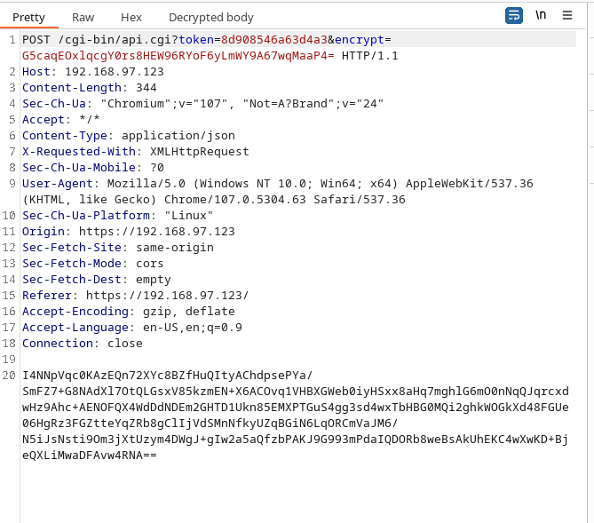
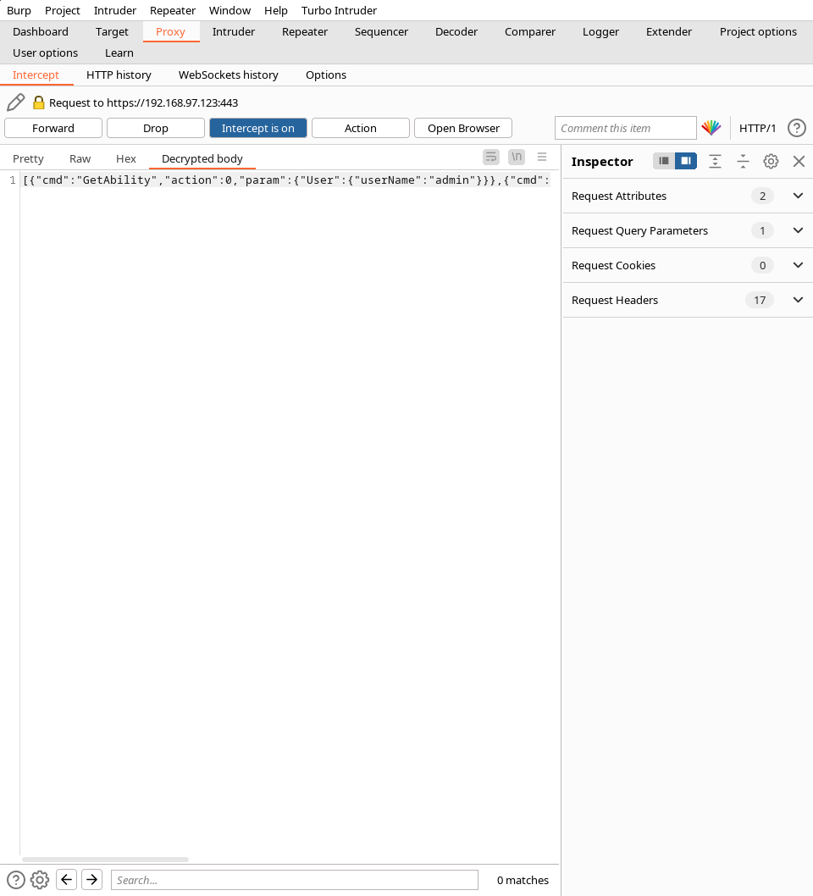
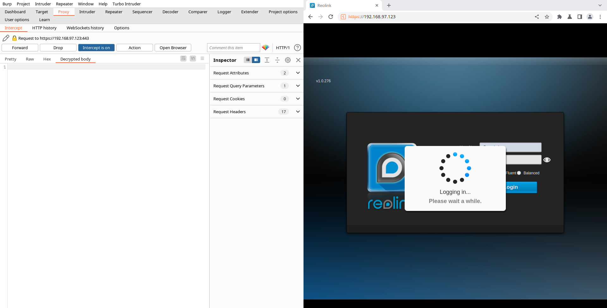

# Reolink decryption extensions

This is a small extension made to automatically decrypt the body of requests going to the web-api of 
reolink 510wa wireless camera.

### Normal request

- here you can see that the body is encrypted

### Decrypted body:

### How to use

- At the moment you have to manually change the PASSWORD variable in reolink_aes_decrypt.py to match the password of the device
- reolink_aes_decrypt.py is the main file which you need to load into burpsuite
- Make sure to turn on intercept, and select the decrypt_body tab when making the login request to the device as seen in the picture below:

- This is when the extension collects the info needed to get the aes key.

### Jython
- To use python extensions in burb you need to have jython installed
- see how in the "Installing Jython or JRuby" section of:
- https://portswigger.net/burp/documentation/desktop/extensions/installing-extensions
